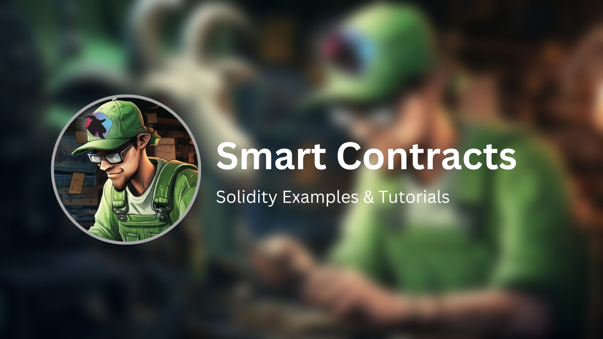

# Smart Contracts
This repository is to serve as a complement to Don Function's YouTube channel, where anyone can learn to code smart contracts in Solidity!

👉 <a href="https://www.youtube.com/@donfunction">WATCH + SUBSCRIBE</a>

👉 <a href="https://twitter.com/don_function">FOLLOW ON TWITTER</a>

## WARNING / DISCLAIMER
While smart contracts typically handle cryptocurrency or units of monetary value, it is important to understand that none of this content, code, accompanying video or media, or anything by Don Function or associated parties, is financial advice of any kind, and none of the aforementioned parties assume the role of a financial advisor. This content is served for educational purposes, tailoring to the programming and technological aspect of Solidity and smart contract development.

Additionally, no code provided via this repository or any of the aforementioned parties or outlets, is to be considered 'production-ready'. You should always carefully audit any code you use, and you alone by using this code (in whole or in part) assume full responsibility for its effects. Don't Trust - Verify.
